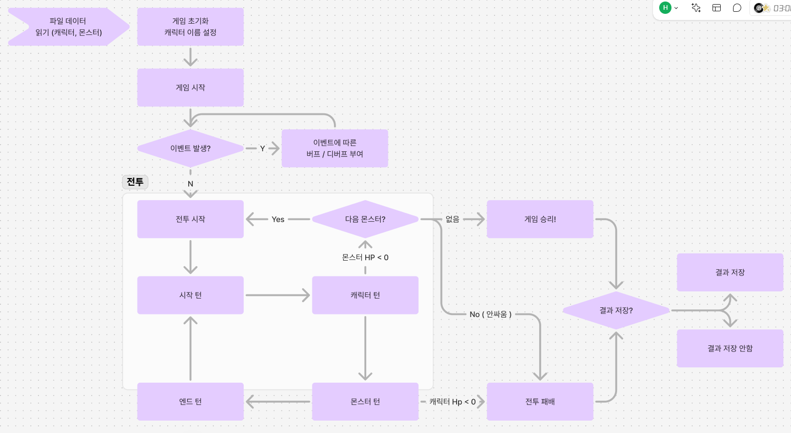

# Battle RPG GAME
개인 과제 - 전투 RPG 게임

## 프로젝트 소개
아래의 기능들이 있는 전투 RPG 게임

  

< 필수 기능 > 
1. 파일로부터 데이터 읽어오기
2. 캐릭터 이름 입력받기
3. 게임 종료 후 결과를 파일에 저장

< 도전 기능 >
1. 게임 시작시 캐릭터 체력 증가 기능
2. 아이템 사용 기능
3. 3턴 마다 몬스터 방어력 증가 기능
4. 자유 구현

## 적용 기능
#### < 필수 기능 >
>* 파일로부터 데이터 읽어오기 : txt 파일에 CSV 형식으로 되어 있는 캐릭터, 몬스터 데이터를 읽어오는 기능
>* 캐릭터 이름 입력받기 : 게임 시작시 캐릭터의 이름을 입력받는 기능
>* 게임 종료 후 결과를 파일에 저장 : 게임 종료 후 결과를 result 파일에 CSV 형식으로 저장하는 기능
#### < 도전 기능 >
>* 게임 시작시 캐릭터 체력 증가 : 게임을 시작할때, 30% 확률로 캐릭터의 체력을 증가 시키는 기능
>* 아이템 사용 : 캐릭터는 시작할때 공격력을 한턴동안 2배 증가시키는 아이템을 가지고 있고, 이를 사용할시 해당 능력이 적용되는 기능
>* 3턴 마다 몬스터 방어력 증가 기능 : 몬스터와의 전투가 길어질 경우, 몬스터의 전투중인 몬스터의 방어력을 증가시키는 기능
#### < 자유 구현 >
>* --

## 🚨 Trouble Shooting

📚[ Random함수, 파일입출력, 정규표현식, 함수의 매개변수 ] 에 대한 학습 및 고찰

### [TIL - 전투 RPG 게임(Random함수, 파일입출력, 정규표현식)](https://hamiric.tistory.com/44)

  

🎨자잘한 코드 개선 1차

### [TIL - 코드개선 1차](https://hamiric.tistory.com/45)

  

## 📝Technologies & Tools (FE)

